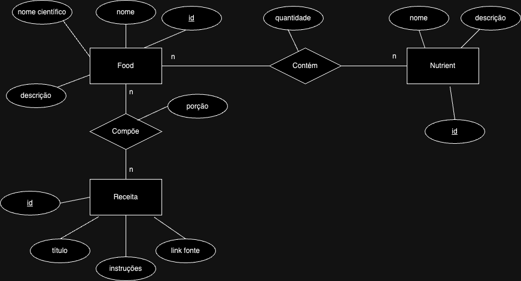

# Projeto 1 - Modelo Conceitual e Lógico

## Slides da Apresentação
[Google Slides](https://docs.google.com/presentation/d/1z5YChWxqOY2Gi0ysH5Cu2qzpsNbFgGhCihPXPbB_s-4/edit#slide=id.p)

## Motivação e Contexto

Já esteve disposto à perder peso e/ou ganhar massa muscular? Se sim, deve ter esbarrado na dificuldade de encontrar receitas gostosas e variadas para incluir na sua rotina. 
Com isso em mente, o projeto busca conciliar variadas receitas com demandas nutricionais específicas.

## Bases de Dados

título da base | link | breve descrição
----- | ----- | -----
FoodDB | https://foodb.ca | base de dados sobre alimentos, sua química, seus ingredientes e nutrientes
RecipeNLG | https://recipenlg.cs.put.poznan.pl/dataset | base de dados com variadas receitas, incluindo o seu modo de preparo, ingredientes e porções

## Modelo Conceitual

## Modelos Lógicos

~~~
FOODS(_id_, name, name_scientific, description)

CONTENTS_FOOD(source_id, food_id, orig_food_common_name, concentration, unit)
  food_id chave estrangeira -> FOODS(id)
  source_id -> NUTRIENTS(id)

NUTRIENTS(_id_, name, description)

RECIPE(_id_, name, instructions, source)

INGREDIENT(_id_, food_id, recipe_id, concentration, unit)
  food_id chave estrangeira -> FOODS(id)
  recipe_id -> RECIPE(id)
~~~

## Perguntas de Pesquisa/Análise
#### Pergunta/Análise 1
* Quais receitas são ideais para um objetivo de hipertrofia?
   * Para uma demanda específica de nutrientes em uma dade proporção (proteína, fibra, etc), quais receitas cumprem o requisito?.

#### Pergunta/Análise 2
* Quais receitas são possíveis de se fazer a partir de ingredientes disponíveis?
  * Por exemplo, a partir de ingredientes disponíveis na sua cozinha, quais receitas você pode fazer, com determinadas demandas nutricionais.

#### Pergunta/Análise 3
* Qual o conteúdo nutricional de uma receita   

   * Este seria o processo inverso, dada uma receita, quais as informações nutricionais dela?.
 
#### Pergunta/Análise 4
* Uma certa receita é recomendável para uma pessoa com restrições alimentares (ex: intolerância à lactose)?

   * Utilizando os ingredientes da receita podemos analisar sua composição química e confirmar se possuem ou não lactose.

### Perguntas/Análise Propostas mas Não Implementadas

#### Pergunta/Análise 1
* Baseado em uma dieta de um determinado consumidor, com foco em ganho de massa muscular, quais alimentos são recomendados para adição em sua dieta? 

   * Utilizando a análise de nutrientes dos alimentos (utilizada nas questões implementadas), poderia ser criada uma nova tabela contendo a distribuição nutricional da dieta de um consumidor para verificar quais são os alimentos mais recomendados para inserção em sua dieta baseado na proporção de macronutrientes presentes nele, em termos gerais, a proporção de gorduras, proteínas e carboidratos.

#### Pergunta/Análise 2
* Continuando a questão anterior, utilizando os alimentos recomendados para determinado consumidor, quais receitas tabeladas poderiam ser encaixadas em sua dieta?
   
   * Tomando como base os alimentos com boas proporções de macronutrientes, poderíamos compará-los aos ingredientes das receitas na base de dados, definindo quais receitas poderiam ser utilizadas na dieta do consumidor sem que haja déficit ou superávit calórico.

#### Pergunta/Análise 3
* Tendo em mãos os alimentos e receitas recomendados para a dieta de um determinado consumidor, como podemos definir a intesidade/quantidade de exercício físico necessário para a manutenção de suas calorias diárias?
  
  * Em uma possível tabela contendo as informações nutricionais de um consumidor (a mesma que deveria ser implementada na análise proposta 1), poderíamos comparar o quantitativo calórico consumido em um dia com a quantidade de calorias diárias a serem ingeridas, de forma a determinar o gasto calórico necessário para abatermos um potencial superávit calórico. Para tanto, uma última tabela deveria ser implementada, de forma a relacionar diversas atividades físicas comumente praticadas e seu respectivo gasto calórico por tempo praticado.

